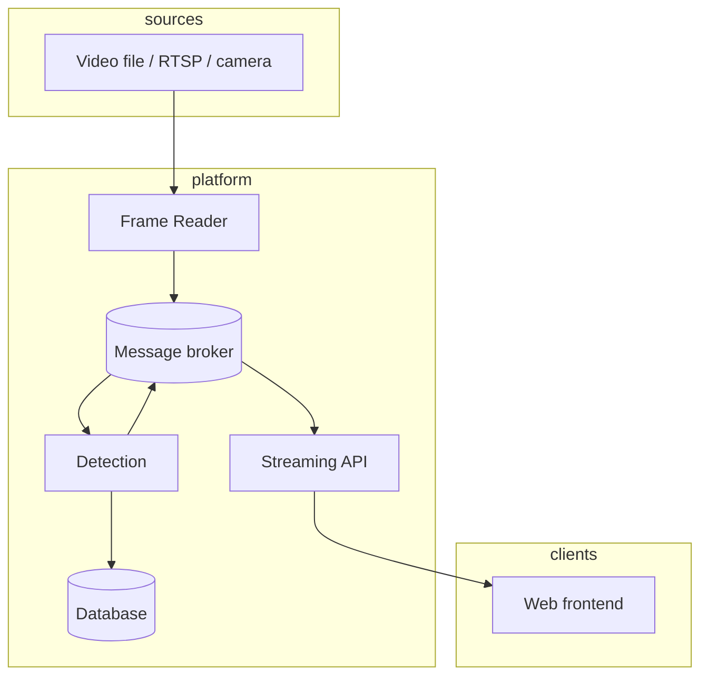
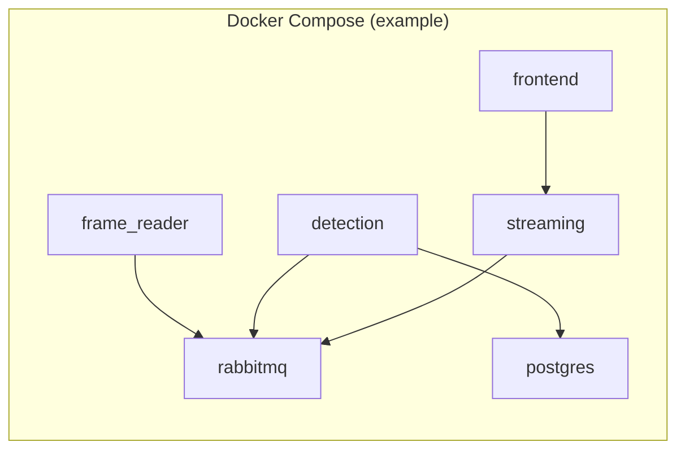

# 01 — System Architecture

This document describes the end-to-end architecture for **Pizza Store Scooper Violation Detection**: a microservices-based computer vision pipeline that ingests video, detects hands, people, pizza, and scoopers, applies ROI-aware violation logic, persists evidence, and streams annotated video with metadata to a web UI.

## 1. Goals (from product requirements)

| Goal | Architectural response |
|------|-------------------------|
| Ingest store video (file or RTSP) | **Frame Reader** service; configurable source |
| Focus on **critical ROIs** only (e.g. protein) | **ROI configuration** consumed by detection; non-critical areas ignored |
| Detect scooper vs bare-hand pickup | **YOLO** detections + **temporal / FSM** logic in **Detection** |
| Violation only when ingredient path violates policy | State machine: ROI interaction → transfer to pizza without scooper |
| Hand in ROI but no pickup (cleaning) | FSM does not emit violation without transfer hypothesis |
| Two workers at the table | **Multi-target tracking** (per-hand / per-person association) inside Detection |
| Real-time UI with boxes, ROIs, alerts | **Streaming** + **Frontend** |

## 2. High-level context

- **Synchronous coupling** is avoided between ingest and inference: the **broker** buffers and decouples producers and consumers.
- **Detection** is the only service that runs the vision model and encodes business rules for violations.
- **Streaming** exposes the outside world: REST for aggregates and a real-time channel for video or overlay data.

## 3. Service inventory

| Service | Responsibility | Primary technologies |
|---------|----------------|------------------------|
| **Frame Reader** | Decode video; timestamp frames; publish to broker | OpenCV / FFmpeg / GStreamer (choose per deployment) |
| **Message broker** | Durable or bounded queues; fan-out to detection and streaming | RabbitMQ or Apache Kafka |
| **Detection** | YOLO inference; ROI masks; tracking; violation FSM; DB writes; publish results | Ultralytics YOLO, tracker, SQL DB |
| **Streaming** | REST (violations metadata); WebSocket / MJPEG / WebRTC for live view | FastAPI (or Flask), async I/O |
| **Frontend** | Video pane; draw boxes and ROIs; violation count and alerts | React (or Vue), canvas / video element |

Optional future or auxiliary components (not required for a minimal pass but allowed by the brief):

- **Config / ROI API**: persist ROI polygons per camera or session.
- **Media / snapshot store**: filesystem or object storage for violation frame images referenced from the DB.

## 4. Logical deployment view

Infrastructure services (**broker**, **database**) typically start first; application services depend on them via health checks or `depends_on` where applicable.

## 5. Data ownership

| Data | Owner | Notes |
|------|--------|--------|
| Raw frames | Transient on broker / in-flight | Prefer small messages or references; avoid storing raw video in the DB by default |
| Detection results | Detection → broker → Streaming | JSON with boxes, labels, frame id, timestamps, violation flags |
| Violation records | Database (Detection writes) | Frame path or URI, boxes, labels, timestamp |
| ROI definitions | Config file or Config API | Loaded at startup or on change; see detection logic doc |

## 6. Cross-cutting concerns

- **Observability**: structured logs per service (correlation id = `frame_id` or `session_id`); metrics on queue depth and inference latency.
- **Security**: RTSP credentials via secrets; API authentication if exposed beyond localhost.
- **Performance**: optional frame skipping or lower resolution for inference; broker back-pressure policy when detection falls behind.

## 7. Related documents

| Document | Topic |
|----------|--------|
| [02-Data-Flow-and-Broker.md](./02-Data-Flow-and-Broker.md) | Queues, message shapes, sequencing |
| [03-Detection-and-Violation-Logic.md](./03-Detection-and-Violation-Logic.md) | ROI, FSM, multi-worker handling |
| [04-Streaming-and-Frontend.md](./04-Streaming-and-Frontend.md) | APIs and UI contract |
| `plan/` | Per-service implementation plans (to be added incrementally) |

## 8. Revision history

| Version | Date | Notes |
|---------|------|--------|
| 0.1 | — | Initial architecture baseline |
