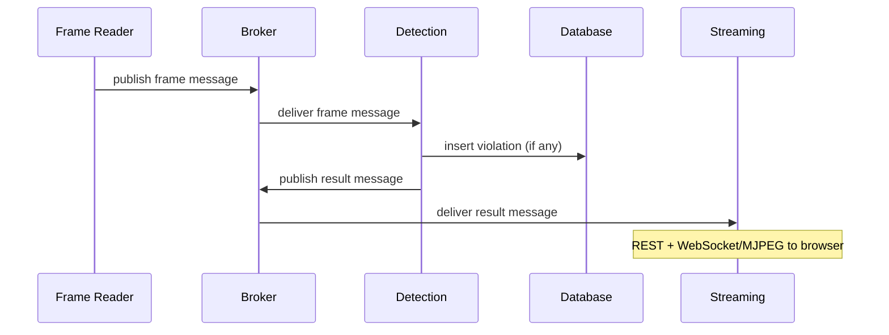

# 02 — Data Flow and Message Broker

## 1. Role of the broker

The **message broker** (RabbitMQ or Kafka) sits between **Frame Reader**, **Detection**, and **Streaming**:

- **Decouples** frame production rate from inference and UI consumption.
- **Buffers** bursts when detection is slower than capture.
- Allows **multiple consumers** (e.g. detection + optional recorder) without changing the reader.

Choose **RabbitMQ** for simpler ops and moderate throughput; choose **Kafka** if you need replay, high fan-out, or long retention.

## 2. Direction of flow

## 3. Suggested exchanges / topics (conceptual)

Names are illustrative; align with environment variables in `.env.example`.

| Name | Producer | Consumer | Content |
|------|-----------|----------|---------|
| `frames` (or `pizza.frames`) | Frame Reader | Detection | Frame id, timestamp, encoding, payload or blob reference |
| `results` (or `pizza.results`) | Detection | Streaming (and optional log) | Boxes, labels, violation flag, optional annotated bytes |

For RabbitMQ: use a **topic** or **direct** exchange with routing keys such as `camera.<id>.frame` and `camera.<id>.result`.

For Kafka: use topics `pizza-frames` and `pizza-detection-results` with partitioning by `camera_id` if multi-camera is introduced later.

## 4. Message shape (guideline)

**Frame message (reader → detection)**

- `frame_id`: monotonic integer per session.
- `timestamp_ms`: wall clock or stream time.
- `source_id`: file path, RTSP URL id, or camera id.
- `image`: JPEG bytes (Base64 in JSON) or binary body with content-type; alternatively a shared-volume path for same-host deployments.

**Result message (detection → streaming)**

- `frame_id`, `timestamp_ms`.
- `detections`: list of `{ bbox, label, confidence, track_id? }`.
- `rois`: optional list of polygon metadata for overlay (or loaded only in streaming from static config).
- `violation`: boolean for this frame or for an **event** (prefer explicit **violation_event_id** when incrementing global count).
- `violation_total`: optional running count for simple UI binding.

Exact schemas should live in shared code (e.g. `shared/schemas.py`) and stay versioned if the pipeline evolves.

## 5. Back-pressure and failure

- **Queue limits**: configure max length or TTL on frame queues to avoid unbounded memory if detection stalls; accept **frame drops** under overload and log them.
- **Poison messages**: dead-letter queues for malformed payloads.
- **Idempotency**: violation inserts should use unique keys (`session_id`, `frame_id`, `event_id`) to avoid duplicate counts on redelivery.

## 6. Related documents

- [01-Architecture.md](./01-Architecture.md) — system context.
- [03-Detection-and-Violation-Logic.md](./03-Detection-and-Violation-Logic.md) — what Detection does with each frame.
